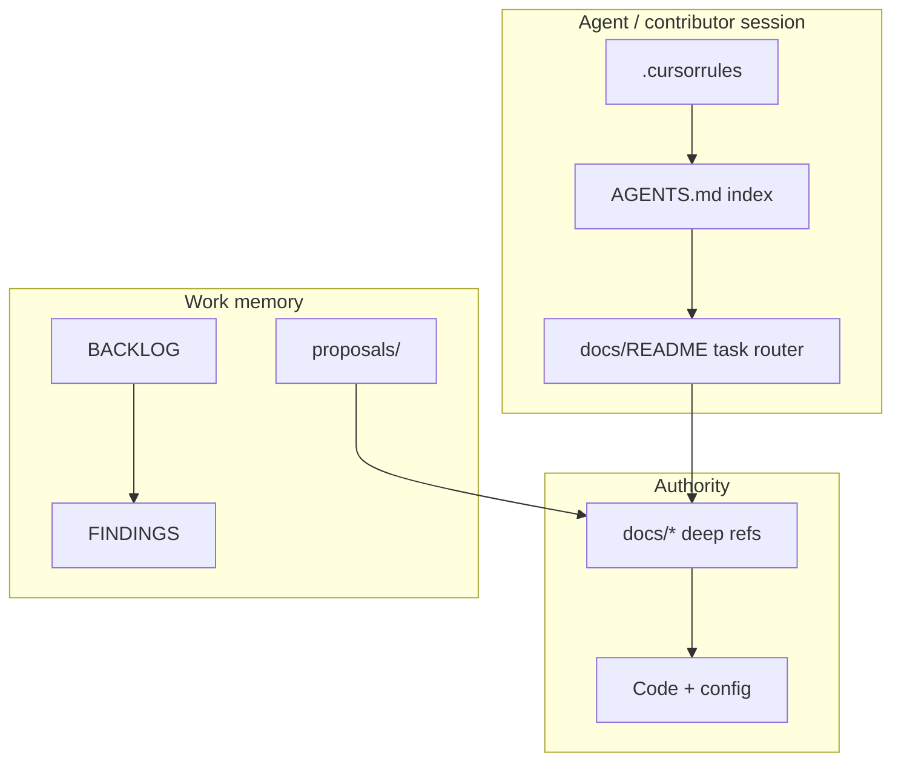

# agent-memory

[](https://github.com/v3gaS/agent-memory/generate)
[](LICENSE)
[](https://raw.githubusercontent.com/v3gaS/agent-memory/main/install.sh)

**Give any codebase a durable memory for humans and AI agents.**

Agent-memory bootstraps a proven documentation + rules system into your project: a thin always-on index (`AGENTS.md`), subsystem deep refs, a task router (“read X, run test Y”), work portfolio (`BACKLOG` / `FINDINGS`), deferred plan capture (`proposals/`), and CI-friendly doc integrity checks.

Works with **any stack** — Python, Node, Go, Rust, mobile, monorepo. Start at maturity **L1**; grow organically to **L4** as the project gains subsystems and operational load ([GROWTH.md](GROWTH.md)).

---

## Why this exists

Coding agents (Cursor, Claude, Copilot, …) start every session with zero context. So do new contributors. Without structure you get:

- Repeated architecture questions
- Doc drift after merges
- Lost “we’ll do that later” items from plans
- Agents that guess instead of reading authoritative refs

Agent-memory fixes that with **fixed roles for fixed files** and a **conflict order** agents must follow:

```text
code + primary config  →  docs/* deep refs  →  AGENTS.md (index only)
```

Behavior changes ship **doc deltas in the same commit**. Tests are **intent** — never weaken assertions to green CI.

---

## Install in one command

From the **root of the project you want to bootstrap**:

```bash
curl -fsSL https://raw.githubusercontent.com/v3gaS/agent-memory/main/install.sh | bash -s -- --target .
```

Interactive prompts ask for project name (stack is **auto-detected** from repo markers — `package.json`, `pyproject.toml`, `go.mod`, etc.). Press Enter to accept the detected stack, or type your own.

### Stack auto-detection

On install, agent-memory scans the target project for stack markers and fills:

- `stack` summary in `agent_memory.state.yaml`
- `AGENTS.md` **Shipped stack** line
- default test command and config path (when not overridden)

When you add a new stack later (e.g. start with Python, add a `package.json` frontend):

```bash
python3 scripts/stack_detect.py --sync
```

This **merges** new signals into `stack_signals` — it does not erase prior ones. Use `--replace` to rebuild from scratch.

Manual additions without marker files:

```yaml
# agent_memory.state.yaml
stack_manual_append:
  - PostgreSQL
  - Redis
```

Then run `python3 scripts/stack_detect.py --sync` to rebuild the summary line.

Skip detection: `install.sh --no-detect-stack` or `apply.py --no-detect-stack`.

### Non-interactive (presets)

```bash
# Python
curl -fsSL https://raw.githubusercontent.com/v3gaS/agent-memory/main/install.sh | bash -s -- \
  --target . --yes --preset python --project-name "My App"

# Node / TypeScript
curl -fsSL https://raw.githubusercontent.com/v3gaS/agent-memory/main/install.sh | bash -s -- \
  --target . --yes --preset node --project-name "My App"

# Go
curl -fsSL https://raw.githubusercontent.com/v3gaS/agent-memory/main/install.sh | bash -s -- \
  --target . --yes --preset go --project-name "My App"

# Rust
curl -fsSL https://raw.githubusercontent.com/v3gaS/agent-memory/main/install.sh | bash -s -- \
  --target . --yes --preset rust --project-name "My App"
```

### Other install paths

| Method | Command |
| --- | --- |
| **Clone + local** | `git clone https://github.com/v3gaS/agent-memory.git && ./agent-memory/install.sh --local --target /path/to/app` |
| **PowerShell** | `git clone …; .\install.ps1 -Target C:\dev\my-app -Yes -Preset python` |
| **Make** | `make install TARGET=../my-app` |
| **CLI** | `./bin/agent-memory install --target ../my-app` |

Full guide: [BOOTSTRAP.md](BOOTSTRAP.md)

---

## What lands in your project

| Artifact | Purpose |
| --- | --- |
| [`AGENTS.md`](templates/AGENTS.md) | Thin index — ownership map, NEVER lines, doc map |
| [`.cursorrules`](templates/.cursorrules) | Cursor ship checklist, conflict order, test discipline |
| [`docs/README.md`](templates/docs/README.md) | Five-tier navigator + **task router** (read X → run test Y) |
| [`docs/CORE.md`](templates/docs/CORE.md) | First subsystem deep ref (you complete it) |
| [`docs/BACKLOG.md`](templates/docs/BACKLOG.md) | Unified work portfolio (`BL-###`) |
| [`docs/FINDINGS.md`](templates/docs/FINDINGS.md) | Live engineering triage (`F-###`) |
| [`docs/proposals/`](templates/docs/proposals/) | Deferred plan follow-ups (not lost in `.cursor/plans/`) |
| [`agent_memory.state.yaml`](templates/agent_memory.state.yaml) | Machine-readable maturity + subsystem registry |
| [`scripts/docs_integrity.py`](templates/scripts/docs_integrity.py) | Link + contract checks |
| [`tests/test_docs_integrity.py`](templates/tests/test_docs_integrity.py) | Doc system regression tests |

After install:

```bash
python3 scripts/docs_integrity.py
python3 -m pytest tests/test_docs_integrity.py -q
git add AGENTS.md .cursorrules docs/ agent_memory.* scripts/ tests/
git commit -m "chore: bootstrap agent memory doc system"
```

---

## Architecture



---

## Grow over time

Add a bounded area (auth, billing, API, worker, …):

```bash
python3 scripts/register_subsystem.py \
  --slug auth \
  --title "Authentication" \
  --paths "src/auth/**" \
  --test "pytest tests/test_auth.py -q" \
  --never "Never store passwords in plaintext"
```

Then complete `docs/AUTH.md` using [SUBSYSTEM_TEMPLATE.md](templates/docs/SUBSYSTEM_TEMPLATE.md).

| Level | When | Adds |
| --- | --- | --- |
| **L1** | First meaningful code | AGENTS + one deep ref |
| **L2** | Regular agent/team use | BACKLOG, FINDINGS, proposals, integrity CI |
| **L3** | 3+ subsystems | CONFIG, DATA_MODEL, OPERATIONS runbook |
| **L4** | Production + audits | API catalog, help/, domain `.mdc` rules, archives |

Details: [GROWTH.md](GROWTH.md)

---

## Design principles

1. **Conflict order:** `code + config` → deep refs → `AGENTS.md` (index only)
2. **Same-commit docs:** behavior + doc changelog together
3. **Thin index:** AGENTS.md links; never mirrors deep refs
4. **Tests are intent:** fix code or fix test *design* — never weaken to pass
5. **Organic growth:** promote tiers when pain appears, not on day one

---

## This repository vs your app

| Repo | Role |
| --- | --- |
| **v3gaS/agent-memory** (this repo) | Installer + templates — the cookie cutter |
| **Your application repo** | Receives `AGENTS.md`, `docs/`, etc. via `install.sh` |

You do not develop your app inside this template repo. You **install from it** into each project.

---

## Template repo layout

```text
agent-memory/
├── install.sh / install.ps1    # Primary installers (curl-safe)
├── apply.py                    # Template copy + placeholder substitution
├── register_subsystem.py       # Add subsystem doc + AGENTS rows
├── bin/agent-memory            # CLI wrapper
├── templates/                  # Files copied into target projects
├── BOOTSTRAP.md / GROWTH.md    # Apply + maturity guides
├── copier.yml                  # Optional Copier flow
└── tests/test_template_repo.py # Self-test
```

Use **GitHub → Use this template** to fork the installer itself. Use **`install.sh --target`** to bootstrap a separate application repo.

---

## Origin

Generalized from the production agent/documentation system in [Stock Scanner API](https://github.com/v3gaS) — battle-tested with five-tier docs, proposals discipline, ownership maps, and docs-integrity CI.

## License

MIT — see [LICENSE](LICENSE).
