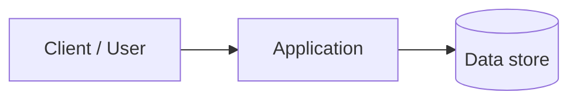

# ARCHITECTURE — {{PROJECT_NAME}}

Last updated: {{DATE}}.

---

## 1. Overview

TODO: One paragraph — what the system does and how major pieces connect.

**Stack:** {{STACK_SUMMARY}}

---

## 2. Topology

TODO: Replace with your real processes (web, API, worker, mobile, monorepo apps, etc.).

---

## 3. Module map

| Path | Responsibility |
| --- | --- |
| `{{SRC_ROOT}}` | Core application code |
| `{{PRIMARY_CONFIG}}` | Runtime configuration |
| `docs/` | Subsystem deep refs + agent memory |
| `tests/` | Automated tests |

---

## 4. Key flows

TODO: Document 1–3 critical flows (request path, job pipeline, deploy unit).

---

## 5. Integration points

TODO: External APIs, webhooks, queues, third-party services. At L3+ add [API_CATALOG.md](API_CATALOG.md).

---

## 6. Changelog

- **{{DATE}}** — Initial architecture stub (agent-memory bootstrap).
