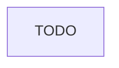

# Core — Full Reference

> First subsystem deep ref for {{PROJECT_NAME}}. Rename file to match domain (e.g. `AUTH.md`) via `register_subsystem.py` when splitting boundaries.

Last updated: {{DATE}}.

---

## Table of contents

1. [Overview](#1-overview)
2. [Data source / inputs](#2-data-source--inputs)
3. [Architecture](#3-architecture)
4. [Data model](#4-data-model)
5. [API surface](#5-api-surface)
6. [Config reference](#6-config-reference)
7. [Runtime flow](#7-runtime-flow)
8. [Integration with other subsystems](#8-integration-with-other-subsystems)
9. [State transitions / lifecycle](#9-state-transitions--lifecycle)
10. [Scheduler / timing](#10-scheduler--timing)
11. [UI surface](#11-ui-surface)
12. [Alerts / notifications](#12-alerts--notifications)
13. [Persistence](#13-persistence)
14. [Research / evaluation](#14-research--evaluation)
15. [Extension hooks](#15-extension-hooks)
16. [Debugging runbook](#16-debugging-runbook)
17. [CLI cookbook](#17-cli-cookbook)
18. [Invariants and safety rules](#18-invariants-and-safety-rules)
19. [Known gotchas](#19-known-gotchas)
20. [Changelog](#20-changelog)

---

## 1. Overview

Core application logic lives under `{{SRC_ROOT}}`. TODO: describe purpose in 3 sentences.

---

## 2. Data source / inputs

TODO: APIs, files, events, user input.

---

## 3. Architecture



TODO: where this subsystem runs (process, service, package).

---

## 4. Data model

See [DATA_MODEL.md](DATA_MODEL.md) for shared stores. TODO: subsystem-specific types.

---

## 5. API surface

TODO: public functions, classes, routes — with file paths and line ranges when stable.

---

## 6. Config reference

See [CONFIG.md](CONFIG.md). TODO: subsystem-specific keys.

---

## 7. Runtime flow

1. TODO
2. TODO

---

## 8. Integration with other subsystems

- **Consumes:** TODO
- **Feeds:** TODO

---

## 9. State transitions / lifecycle

N/A — or TODO.

---

## 10. Scheduler / timing

N/A — or TODO.

---

## 11. UI surface

N/A — or TODO.

---

## 12. Alerts / notifications

N/A — or TODO.

---

## 13. Persistence

See [DATA_MODEL.md](DATA_MODEL.md).

---

## 14. Research / evaluation

N/A — or TODO.

---

## 15. Extension hooks

TODO: how to add features safely.

---

## 16. Debugging runbook

### 16.1 Symptom: tests fail after core change

**Diagnose:**

```bash
{{DEFAULT_TEST_COMMAND}}
```

**Fix:** never weaken assertions; see [AGENTS.md](../AGENTS.md).

### 16.2–16.8 TODO

---

## 17. CLI cookbook

```bash
{{DEFAULT_TEST_COMMAND}}
```

---

## 18. Invariants and safety rules

1. Behavior changes require this doc's changelog in the **same commit**.
2. Run task-router **Tests** after edits: `{{DEFAULT_TEST_COMMAND}}`.

---

## 19. Known gotchas

- TODO

---

## 20. Changelog

- **{{DATE}}** — Initial core deep ref (agent-memory bootstrap).
